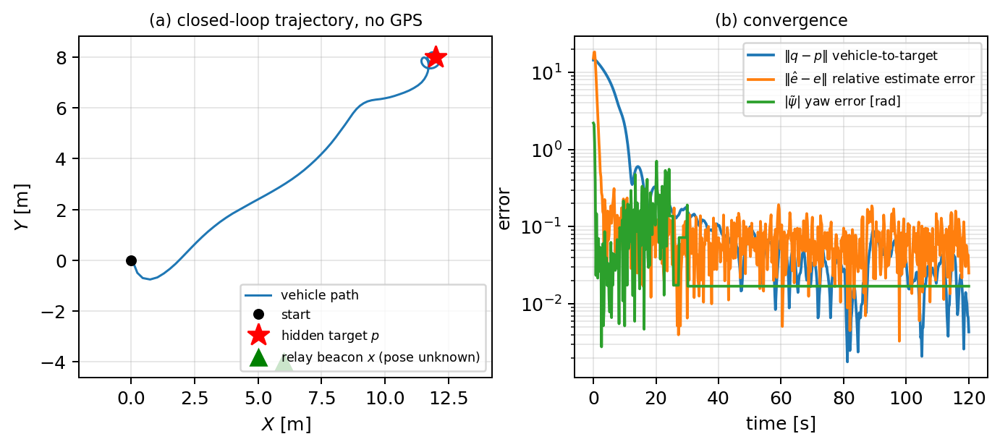
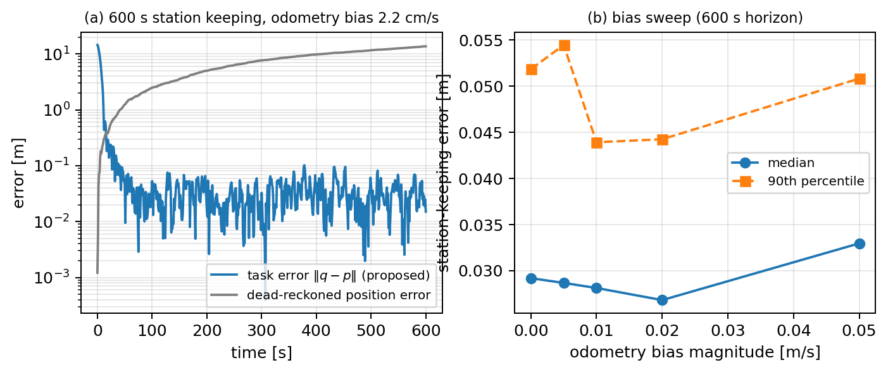

# GPS-Free Hidden-Target Seeking

Companion repository for the paper on hidden-target seeking
without global pose: the vehicle has no absolute position, the relay's pose is
unknown, and the target is observable only through relay-local range-bearing
packets. The full three-dimensional $SE(2)$ placement of vehicle, relay,
and target is provably unobservable by any estimator; the estimator and
controller operate entirely on the task-relevant quotient (the
relay-to-odometry yaw and target displacement), which is completely
identifiable from two distinct vehicle views.

This repo contains the simulation/estimator code and the curated evidence
archive backing the paper's numbers. It does not contain the paper source
itself.

## What's here

```
include/gps_free_seeking/   Estimator, certificate, supervisor, baselines (header-only core)
src/                        Campaign runner, single-scenario driver, viz dump
tests/                      Registration, delay, detector, and closed-loop acceptance tests
config/campaign2027/        Frozen parameter set used for every citable run
scripts/                    Campaign aggregation, figure rendering, video tooling
ros2_ws/src/gps_free_seeking_msgs/   ROS 2 message definitions
ros2_ws/src/gps_free_seeking_gz/     Gazebo (gz sim / ROS 2 Jazzy) physics-based validation package
results/campaign2027/offline/   Curated evidence archive: manifests, summaries, checksums (no raw per-trial data)
```

Every citable result is tied to a specific git commit hash, recorded in its
manifest, with a SHA-256 checksum ledger (`checksums.sha256`) covering every
artifact in the run directory. Raw per-trial CSVs and Gazebo per-run logs are
intentionally not committed here — only the aggregated summaries and manifests
needed to verify and reproduce the headline numbers. Raw data is available on
request.

**Provenance note.** The commit hashes below (`212a98b`, `0af4309`) identify
the source-tree state in the private development history where each
campaign was run and provenance-locked; they are recorded verbatim in every
manifest for verification but are not reachable in this public repo's own
(squashed) commit graph, which starts fresh from the code and evidence at
that state. This repository's own HEAD is the reference point for anything
not tied to one of those hashes.

## Build and run

```bash
cmake -S . -B build -DCMAKE_BUILD_TYPE=Release
cmake --build build
./build/tests/se2_tests        # acceptance suite
./build/campaign                # Monte Carlo / robustness campaign runner
```

The Gazebo package additionally requires ROS 2 Jazzy + `gz sim` (Harmonic);
see `ros2_ws/src/gps_free_seeking_gz/README.md`.

## Results

All numbers below are from the citable offline campaign at commit
[`212a98b`](results/campaign2027/offline/run_212a98b29759e3e4f21e29c33341a47c3da9c80c/CLEAN_RUN_SUMMARY.md)
(200 paired randomized geometries per row) and the Gazebo physics-based
validation campaign (90 independent launches, commit `0af4309`). Full detail,
including calibration coverage statistics and every robustness sweep, is in
[`CLEAN_RUN_SUMMARY.md`](results/campaign2027/offline/run_212a98b29759e3e4f21e29c33341a47c3da9c80c/CLEAN_RUN_SUMMARY.md).

### Estimator baselines (offline, 200 randomized geometries)

| Method | Success | Median RMSE (m) | 95% bootstrap CI (m) | Median time-to-goal (s) | Runtime (us/update) |
|---|---:|---:|---:|---:|---:|
| Proposed | 200/200 | 0.0639 | [0.0583, 0.0694] | 14.00 | 3.60 |
| Proposed + smoother | 200/200 | 0.0639 | [0.0583, 0.0694] | 14.00 | 181.72 |
| Known-yaw oracle | 200/200 | 0.0653 | [0.0594, 0.0715] | 12.85 | 4.06 |
| Sequential EKF | 200/200 | 0.0868 | [0.0797, 0.0950] | 14.17 | 0.28 |
| Endpoint-only | 194/200 | 0.0708 | [0.0641, 0.0785] | 27.06 | 0.25 |
| Fixed-decay excitation | 200/200 | 0.0625 | [0.0588, 0.0682] | 14.01 | 3.49 |
| No excitation | 0/200 | 10.3256 | [9.7793, 11.0267] | -- | 3.62 |

The proposed estimator tracks the known-yaw oracle to within ~2% median RMSE.
The paired median EKF-minus-proposed RMSE difference is +0.0193 m (95%
bootstrap interval [+0.0146, +0.0274] m) — a real, non-strawman margin. The
fixed-lag smoother is statistically indistinguishable from registration alone
at ~50x the runtime cost; this is reported as a negative result, not omitted.



### Robustness (offline)

- Relay noise: 200/200 success through 0.4 m range noise and 4 deg bearing
  noise; hardest cell has 0.170 m median RMSE.
- Communication degradation: 200/200 success through 50% dropout, 0.5 s fixed
  delay, 0.2 s jitter, and 20% packet outliers; median RMSE at 20% outliers is
  0.204 m.
- Long-horizon drift (600 s): 100/100 success per cell; median station RMSE
  0.058-0.064 m while dead reckoning drifts to a median 27.2 m at 5 cm/s
  body-frame bias.



### Physics-based Gazebo validation (90 independent launches, commit `0af4309`)

The identical estimator, certificate, and controller drive a physics-based
differential-drive vehicle in Gazebo: wheel joints with contact friction and
chassis inertia, wheel odometry from the simulator's own drive-train
integration (not ground truth), and asynchronous packet delivery through the
same ROS 2 interfaces intended for deployment. Gazebo's physics integration is
not bitwise-deterministic run to run, so only the aggregate statistics below
are cited — never a single seed's raw value.

| Scenario | Success | Median station RMSE (m) | Notes |
|---|---:|---:|---|
| Nominal | 30/30 | 0.077 (IQR 0.051-0.094, max 0.139) | vs. 0.065 m offline; gap attributed to wheel slip/inertia absent from the offline unicycle model |
| Stress (combined comms degradation) | 30/30 | 0.164 (IQR 0.149-0.198, max 0.238) | 30% dropout, 0.2s delay, 0.1s jitter, 5% outliers simultaneously |
| Disturbance (60 deg relay yaw step, mid-transit) | 30/30 | -- | Adoption at median 7.3s post-step; task recovery at median 10.3s; every trial succeeds |

Gazebo's curated manifests/summaries land in
`results/campaign2027/ros_gz/citable/0af43095d347c3ca46e4fcfec34d9ecc4165f208/` in
a follow-up commit.

## Reproducing

Every manifest records the exact source commit, build flags, and config hash
used to produce it. To verify a result directory:

```bash
sha256sum -c checksums.sha256   # run inside a results/.../run_<hash>/ directory
```

## Citing

If you use this code or data, please cite the associated paper
(citation to be added on acceptance/arXiv posting).
